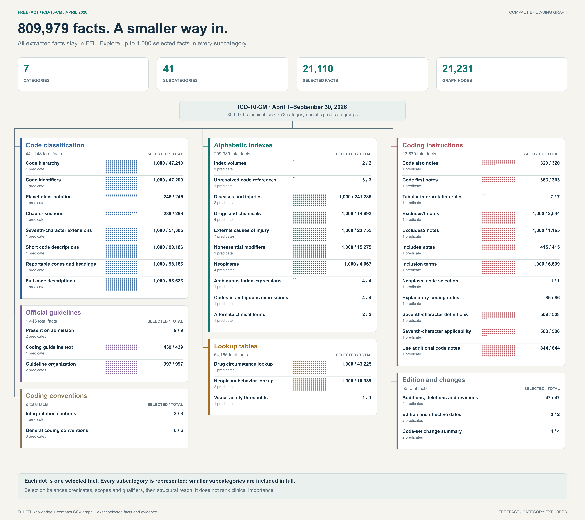
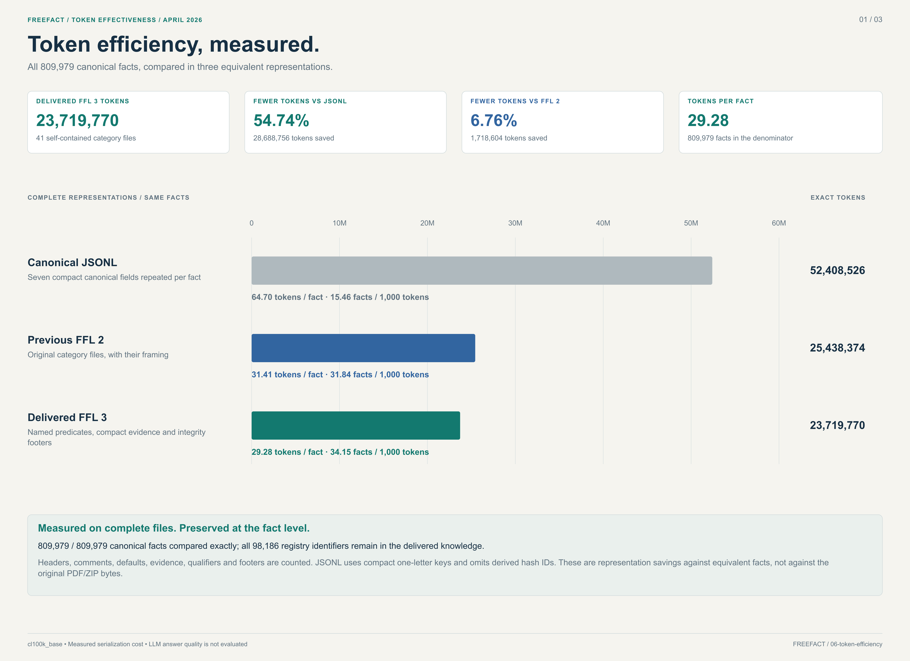
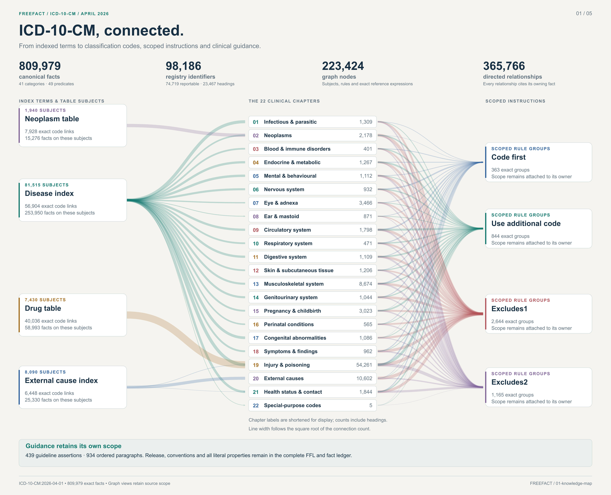
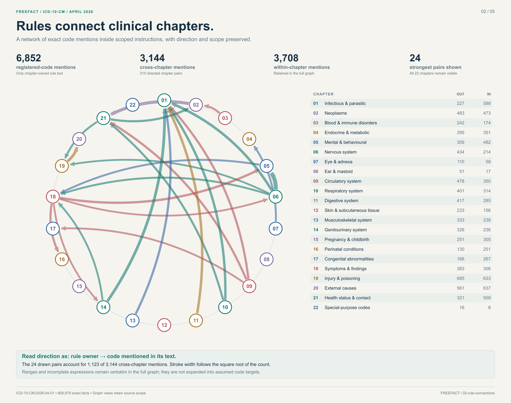
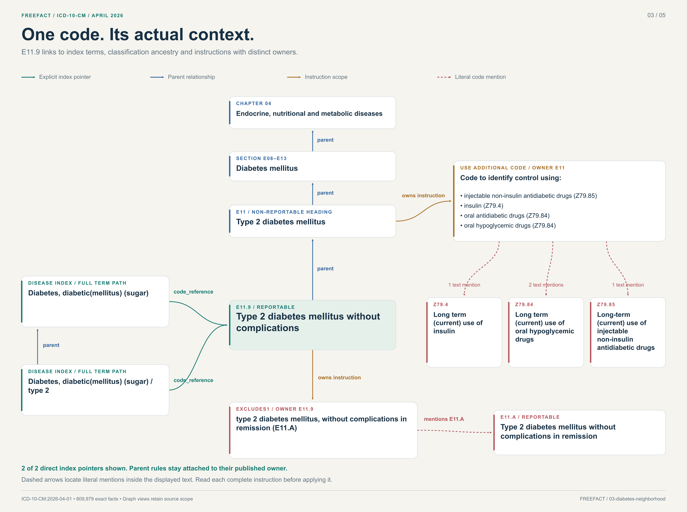
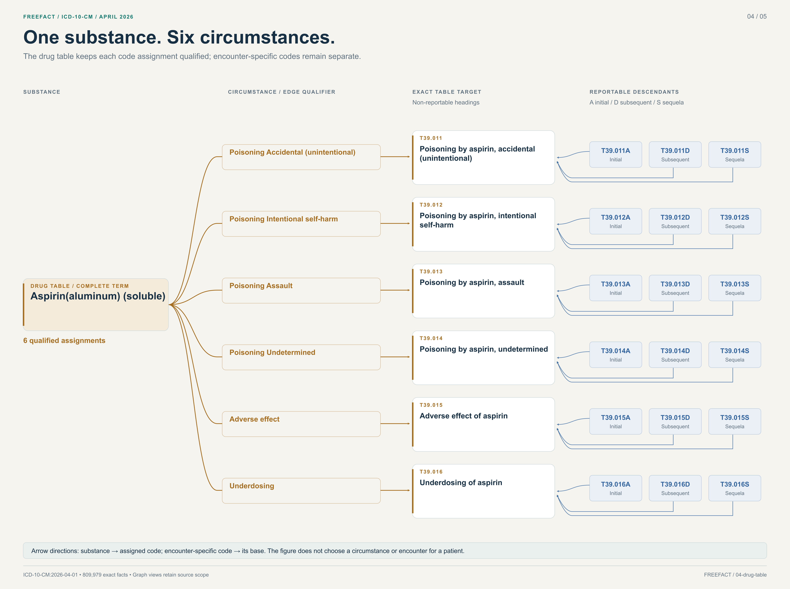
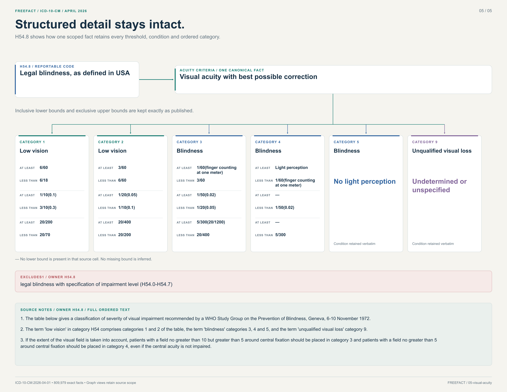
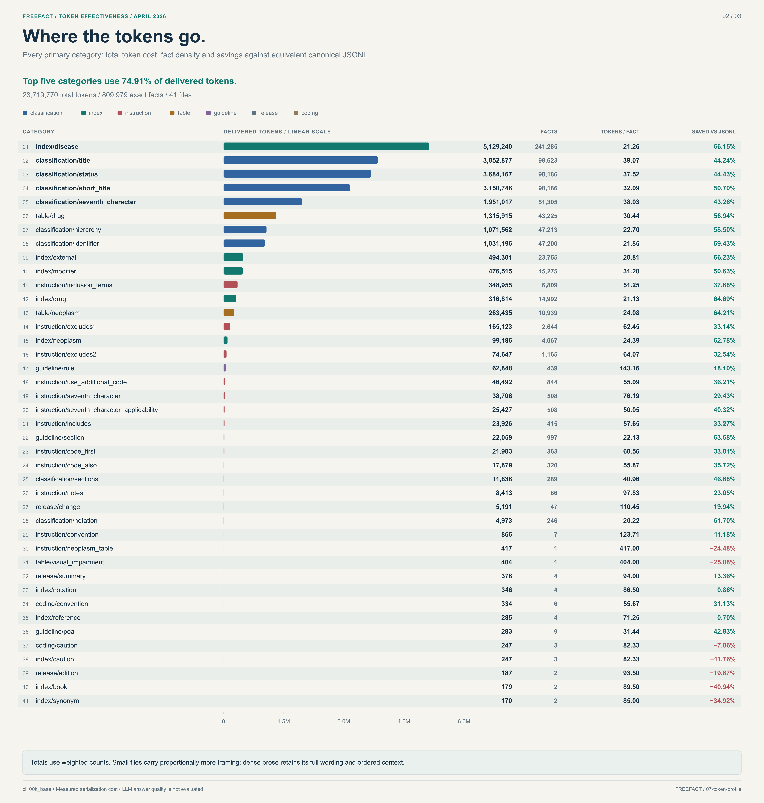
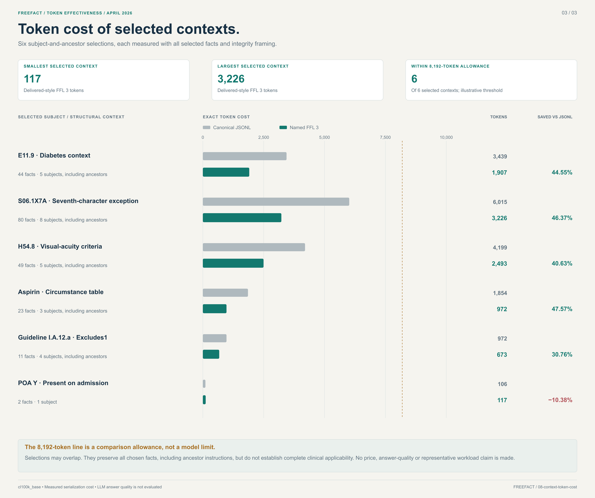

# FreeFact · ICD-10-CM April 2026

**809,979 exact facts. A compact graph for discovery. Measured token efficiency.**

This repository packages the supplied **ICD-10-CM April 1–September 30, 2026** edition as 41 self-contained FreeFact Language (FFL) files. The complete extracted knowledge is retained. A smaller graph makes its categories, predicates and selected facts easier to explore.

[Knowledge](knowledge/READING.md) · [Compact graph](graph/README.md) · [Visual atlas](visualizations/README.md) · [Token measurements](metrics/README.md) · [Validation](validation.json)

[](visualizations/00-category-explorer.svg)

*Each dot is one selected fact. Counts show selected / total facts. Click the image for the scalable SVG.*

## At a glance

| Complete knowledge | Compact browsing graph |
|---|---|
| **809,979 facts** in **41 FFL files** | **21,110 selected facts** |
| **98,186 registry identifiers** | **7 categories · 41 subcategories** |
| **74,719 reportable codes** | **72 category-specific predicate groups** |
| Exact values, qualifiers and evidence IDs | **21,231 nodes · 21,230 containment links** |

The graph includes **1,000 actual facts per subcategory**, or every fact when fewer exist. **25 subcategories are included in full**; the other 16 have 1,000 facts each. Its selection balances predicates, structural scopes and qualifiers, then prioritizes subjects by structural reach and explicit references. “Top” means a reproducible browsing priority. It does not mean clinical importance or prevalence. [Selection method](graph/SELECTION.md)

## Start here

**Read the knowledge.** Begin with the [FFL reader guide](knowledge/READING.md) and [category manifest](knowledge/manifest.json). Every FFL file contains readable predicates, edition/category/subject defaults and a checked integrity footer. Facts for one subject can span multiple files.

**Import the compact graph.** Load [nodes.csv](graph/nodes.csv), then [links.csv](graph/links.csv). Headers are `ID,Label,Category` and `source,target,weight,Label`. [Selected facts](graph/selected-facts.csv) carry the exact assertion, full subject label, rank, qualifiers, evidence and FFL location. [Coverage](graph/coverage.csv) shows the full and selected counts for all 41 subcategories.

Both import files are below **2 MiB** and use **integer node IDs and link endpoints**. Import both from the same release. Names use readable domain vocabulary, such as **Coding instructions → Code also notes → Other codes that may be needed**. [Node details](graph/node-details.csv) retain semantic keys and full labels; `Node_ID` connects each selected fact to its node.

**Verify or query locally.** Python 3.11+ and its standard library are sufficient:

```sh
python3 tools/verify.py
python3 tools/query.py cm:E11.9 --ancestors
```

The verifier checks every FFL file and canonical digest, reconstructs the top-1,000 selections independently, and checks graph counts, facts, links, visuals and file checksums. The query prints exact canonical JSONL for the subject and its structural ancestors; it does not determine clinical guideline applicability.

## Token effectiveness

[](visualizations/06-token-efficiency.svg)

The complete FFL uses **23,719,770 `cl100k_base` tokens**, including headers, evidence, qualifiers and footers: **54.74% fewer than equivalent canonical JSONL** and **6.76% fewer than the previous FFL 2**. Average: **29.28 tokens per fact**. These are measured representation costs. [Method, CSVs and independent recount](metrics/README.md)

## Visual atlas

All **nine SVG/PNG pairs** are included locally. SVGs have selectable text and embedded provenance; PNGs are at least 5,000 pixels wide. The category explorer describes the current compact graph. The five source-wide/detail research views retain their stated scopes and small supporting datasets; their historical full-graph counts are not the size of the compact export.

<details>
<summary>Open the eight research and token visualizations</summary>

### Source-wide knowledge map

[](visualizations/01-knowledge-map.svg)

### Cross-chapter rule connections

[](visualizations/02-rule-connections.svg)

### E11.9 neighborhood

[](visualizations/03-diabetes-neighborhood.svg)

### Aspirin circumstances

[](visualizations/04-drug-table.svg)

### Visual-acuity criteria

[](visualizations/05-visual-acuity.svg)

### Token efficiency

[](visualizations/06-token-efficiency.svg)

### Token cost by category

[](visualizations/07-token-profile.svg)

### Selected context costs

[](visualizations/08-context-token-cost.svg)

</details>

[Open the visual index and downloads](visualizations/README.md)

## Repository contents

| Path | Purpose |
|---|---|
| [knowledge/](knowledge/READING.md) | Complete FFL knowledge, vocabulary, format and edition manifest. |
| [graph/](graph/README.md) | Compact category → subcategory → predicate → selected-fact graph. |
| [visualizations/](visualizations/README.md) | Nine SVG/PNG pairs and small supporting research-view datasets. |
| [metrics/](metrics/README.md) | Token counts, four CSV tables and independent token validation. |
| [validation.json](validation.json) | Current repository and compact-graph validation. |
| [validation/extracted-knowledge.json](validation/extracted-knowledge.json) | Immutable prior extraction-preservation audit, including its limits. |
| [tools/](docs/DEVELOPMENT.md) | Portable reader, query, deterministic graph builder, verifier and figure tools. |
| [manifest.json](manifest.json), [CHECKSUMS.sha256](CHECKSUMS.sha256) | Inventory, sizes and SHA-256 checksums. |

## Fidelity and boundaries

All **809,979 extracted facts** and **98,186 registry identifiers** are preserved. The compact graph samples facts for browsing; omitted graph facts remain in FFL. No full entity graph or duplicate all-facts CSV is shipped.

The inherited direct source audit compared 809,455 unique facts and left **524 outside direct exact comparison**, including 439 guideline prose scopes. Exact preservation of the extracted facts is verified; full source replacement and clinical reasoning equivalence remain **unproven**. Evidence IDs are retained. Resolving them back to source locations requires the separate original audit bridge. This repository covers the supplied US clinical modification, not ICD-10-PCS or every WHO ICD-10 edition.

## Source and publication

Source: **CDC / National Center for Health Statistics**, ICD-10-CM April 2026. The original materials are available at no charge from the [official CDC release page](https://www.cdc.gov/nchs/icd/icd-10-cm/files.html). This is an independent derived representation; it is not endorsed by CDC, HHS, CMS or the US Government.

[Source attribution and terms](NOTICE.md) · [Licensing](docs/LICENSING.md) · [Contributing](CONTRIBUTING.md) · [Changes](CHANGELOG.md) · [Publishing guide](docs/PUBLISHING.md)
